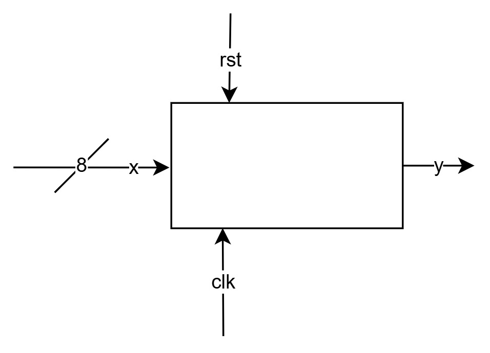
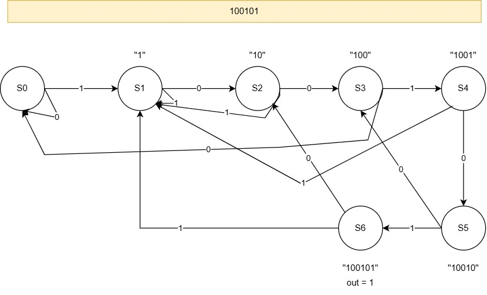

## TP 1 - Detetor de Sequencias

### 1. Introdução

- Este trabalho tem como objetivo a implementação de uma **Máquina de Estados Finitos (FSM)** capaz de reconhecer a sequência de bits **100101**.

- A FSM é composta por uma entidade que inclui os seguintes sinais:
    - **clk** - Sinal de relógio
    - **rst** - Sinal de reset
    - **x** - Sinal de entrada
    - **y** - Sinal de saída


### 2. Desenvolvimento

### 2.1 Arquitetura

- A *FSM* foi implementada com base na seguinte arquitetura:



- A entidade em *VHDL* representa um módulo de *hardware* que simula os componentes internos de um processador, utilizando sinais para controlar das transições de cada estado.

- Quando a sequência **100101** é detetada, a saída *y* é ativada **(y = '1')**, caso contrário, *y* permanece desativada *(y = '0')*.
- A *FSM* opera utilizando sete estados distintos, realizando transições com base no sinal de entrada *x* e no *rising edge do clock*.
- O código *VHDL* correspondente à definição dos estados, é apresentado abaixo:

```vhdl
-- Finite state machine
architecture tp1 of tp1 is
    state_type : type is (s0, s1, s2, s3, s4, s5, s6);
    signal state, next_state : state_type;
    signal y_reg : std_logic;
```

<!-- Screenshot da simulação -->

### 3. Conclusão

