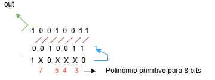
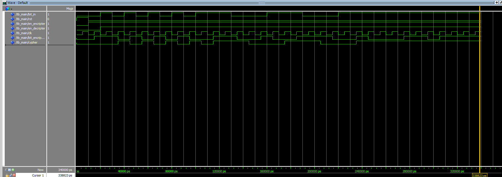

# Autor: Bruno Gonçalves - a74528

## TP 2 - Encriptação em stream LFSR

### Introdução
- Este trabalho tem como objetivo desenvolver uma arquitetura em VHDL de um desencriptador de dados em stream. 
- O seu funcionamento baseia-se na utilização de uma `LFSR` (Linear Feedback Shift Register) para gerar uma sequência pseudo-aleatória que é utilizada para desencriptar os dados recebidos.

### Arquitetura

- Será utilizado uma LFSR de 8 bits, com um polinómio primitivo `7 5 4 3`, para gerar uma sequência pseudo-aleatória.
- O bit mais significativo (bit 7) é deslocado para o bit 6, o bit 6 para o bit 5, e assim sucessivamente.
- Os bits 5, 4, 3 são atualizados com o valor do antigo `bit mais significativo` através de uma operação XOR.
- O bit menos significativo `bit 0` é retirado como bit de saída a cada ciclo de clock. Este se repetirá após 256 ciclos.

A arquitetura é composta por:
  - LFSR de 8 bits
    - Entradas
        - `clk`: Sinal de clock
        - `rst`: Sinal de reset
        - `en`: Sinal de ativação
        - `seed`: Semente de inicialização do LFSR
    - Saídas
        - `key`: Sequência pseudo-aleatória gerada pela LFSR
  - Desencriptador
    - Entradas
        - `key`: Sequência pseudo-aleatória gerada pela LFSR
        - `msg`: Bitstream de dados a desencriptar
        - `rst `: Sinal de reset
        - `clk`: Sinal de clock
        - `en`: Sinal de ativação
    - Saídas
        - `cyper`: Dados desencriptados

### Desenvolvimento
- Tendo em conta a arquitetura já definida, o desenvolvimento do código VHDL é realizado em duas partes: a LFSR e o desencriptador.

### Simulação

### Conclusão
Em resumo, esta LFSR, permite gerar sequências pseudo-aleatórias de forma eficiente, pois as operações XOR são distribuídas ao longo dos diversos estágios do registrador, tornando o circuito mais simples e rápido (não passam pelo o input).

