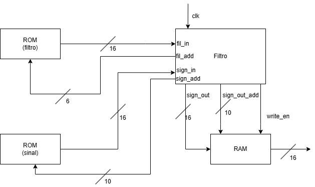

# Autor: Bruno Gonçalves - a74528

## TP 3 - Filtro FIR Digital

### Introdução
Este projeto tem como objetivo implementar um filtro digital FIR (Finite Impulse Response) em VHDL para processar um sinal de entrada ruidoso e gerar um sinal filtrado. O filtro é baseado na operação de convolução entre os coeficientes pré-definidos do filtro e os dados do sinal, com o intuito de atenuar ruídos ou realçar frequências específicas.

O projeto utiliza ROMs para armazenar os coeficientes do filtro e os dados do sinal de entrada, RAM para armazenar o resultado da filtragem e um componente dedicado para escrever os dados processados em um arquivo de texto para posterior análise gráfica.

### Componentes

- `filter_component.vhd`: Unidade principal que implementa a lógica do filtro FIR, realiza a convolução entre os coeficientes do filtro e controla a leitura dos coeficientes e dos dados do sinal, representados em formato signed de 16 bits.
- `filter_rom.vhd`: Memória ROM que armazena os coeficientes do filtro FIR (valores fixos).
- `noisy_signal.vhd`: Memória ROM que armazena os dados do sinal de entrada (sinal ruidoso), também representados em signed de 16 bits..
- `ram.vhd`: RAM utilizada para armazenar os resultados da filtragem em tempo real, podendo ser acessada para leitura posterior.
- `write_on_file`: Componente que grava os resultados do filtro em um ficheiro de texto, para posterior análise gráfica.
- `tb_filter_component.vhd`: Testbench para simular o funcionamento do filtro completo, aplicando sinais de entrada, reset, clock e habilitação, e monitorando os resultados.

### Arquitetura / Fluxo

- Inicialização: O filter_component começa a ler sequencialmente os coeficientes do `filter_rom` e os dados do `noisy_signal` para armazená-los em arrays internos.

- Convolução: Após a inicialização, o filtro realiza a operação de convolução, multiplicando os coeficientes pelos dados do sinal e acumulando o resultado.

- Escrita do Resultado: Cada valor resultante da convolução é armazenado na ram e enviado ao componente write_on_file para ser gravado no arquivo texto.

- Finalização: O processo segue até que todo o sinal tenha sido filtrado, momento em que a simulação ou operação pode ser encerrada.

### Conclusão
Este projeto demonstra a implementação prática de um filtro FIR digital em VHDL, com uma arquitetura modular que facilita o entendimento e o reaproveitamento de componentes. A combinação de ROMs, RAM e componentes auxiliares permite simular um fluxo completo de processamento de sinais digitais, incluindo a geração de dados para análise externa.