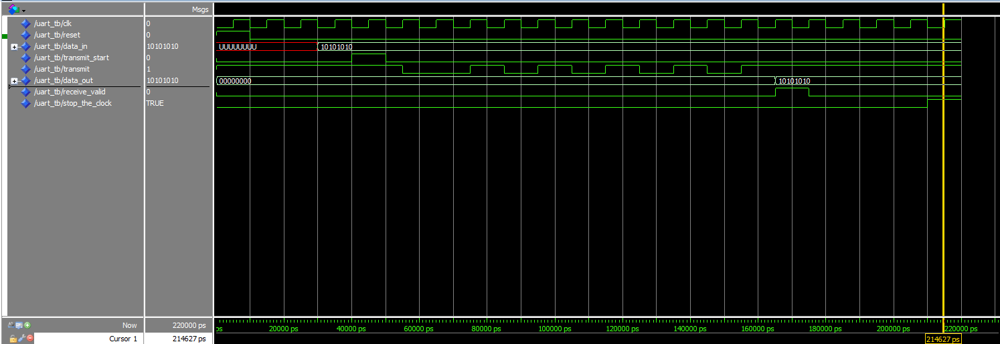

# Autor: Bruno Gonçalves

## UART - Transmissão Assíncrona de Dados

### Introdução
O objetivo deste trabalho é implementar um transmissor UART (Universal Asynchronous Receiver-Transmitter) através de um emissor e um receptor. O emissor deve ser capaz de enviar dados de 8 bits e o receptor deve ser capaz de receber esses dados, verificando a paridade e o stop bit. A transmissão é assíncrona, ou seja, não há um relógio(EN) compartilhado entre o emissor e o receptor, contudo receptor deve ser capaz de detetar quando o emissor está pronto para enviar dados e iniciar a receção.

### Arquitetura / Fluxo
- Exemplo de transmissão: `0(start)10010010 1(CRC)1(stop)`
- 1. O emissor envia um bit de start (0) para indicar que está pronto para enviar dados.
- 2. O emissor envia os 8 bits de dados (10010010).
- 3. O emissor envia um bit de paridade (1) para verificar a integridade dos dados.
- 4. O emissor envia um bit de stop (1) para indicar que a transmissão foi concluída.
- 5. O receptor recebe os dados e verifica a paridade e o stop bit.

### Waveform Simulação
- Simulação sem erros

### Conclusão
A implementação do transmissor UART foi bem-sucedida, permitindo a transmissão assíncrona de dados de 8 bits com verificação de paridade e stop bit. A simulação demonstrou o funcionamento correto do emissor e receptor, tanto em condições normais quanto em situações de erro.