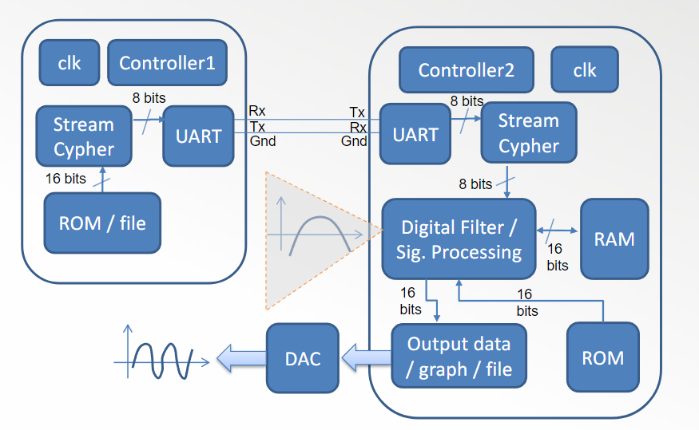
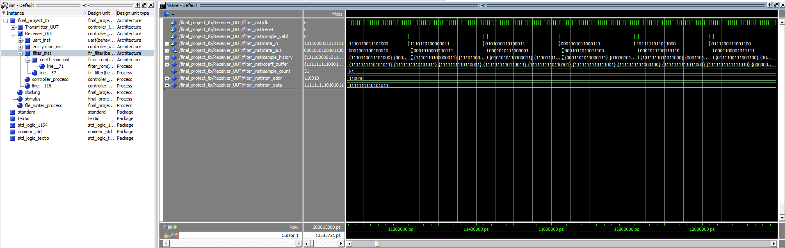
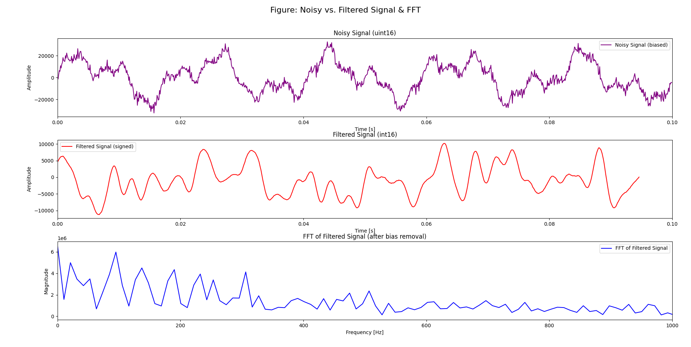

# Autor: Bruno Gonçalves

## TP5 - TP Final

O objetivo deste trabalho é desenvolver uma arquitetura em VHDL, sendo necessário a reutilização de componentes já desenvolvidos nos TPs anteriores.
Esta arquitetura deve ser capaz de realizar a leitura de conjunto de bits armazenados numa rom com um tamanho de 16 bits. Seguidamente, a nossa LFSR que está contida no Stream Cypher deverá encriptar e enviar os bits um a um por meio de uma entidade denominada por UART. Por outro lado, o recetor também uma UART deverá receber os bits encriptados, onde deverá de os reencaminhar para outro Stream Cypher que será responsável por desencriptar os bits recebidos, guardando-os numa register temporária. Quando finalizado este processo, é guardado os conjuntos de bits num ficheiro de texto.

### Arquitetura / Fluxo
A arquitetura do sistema é composta por várias entidades interligadas, cada uma com uma função específica. A seguir, é descrito o fluxo de dados e as principais entidades envolvidas:

- O Stream Cypher lê os bits de uma ROM de 16 bits.
- O Stream Cypher utiliza a LFSR para encriptar os bits lidos.
- Enviar os bits encriptados um a um através da UART, porém os dados obtidos da ROM são um conjunto de 16 bits, logo, é necessário enviar os bits em pacotes de 8 bits.
- O recetor UART recebe os bits encriptados, um a um.
- O recetor UART reencaminha os bits recebidos para o Stream Cypher.
- O Stream Cypher desencripta os bits recebidos e guarda-os numa register temporária.
- Quando o processo de desencriptação é finalizado, os bits são guardados num ficheiro de texto.



### Simulação
Para verificar o funcionamento do sistema completo, foi desenvolvido um testbench, ```tb.vhd```. 
Este testbench:

- Instancia os dois controladores, controller_in e controller_out.
- Conecta a saída tx do transmissor à entrada rx do recetor.
- Fornece os sinais globais de clk e reset.
- Ativa ambos os controladores e deixa a simulação correr.
- Grava a saída final e filtrada num ficheiro de texto (filtered_signal_output.txt) sempre que um novo valor é calculado, para posterior análise.

#### Waveform


#### Sinal filtrado



### Conclusão
Os resultados da simulação, especialmente a análise gráfica do sinal antes e depois da filtragem, demonstram a eficácia do filtro FIR em remover o ruído e "limpar" o sinal, cumprindo assim todos os objetivos propostos para este trabalho final.